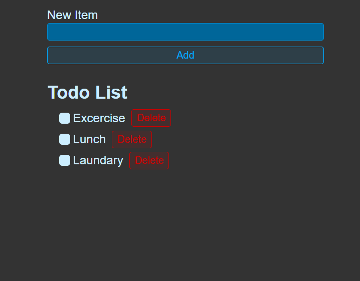

# 📝 Modern To-Do List

A high-performance, responsive To-Do List application. This project demonstrates clean component architecture,persistent storage, efficient state management, and automated deployment pipelines.

[**🚀 View Live Demo**](https://Muhammad-Zubair796.github.io/ToDoList/)

---

## 📸 Preview



---

## 🛠️ Tech Stack


---

## ✨ Features

- **Responsive Design:** Works perfectly on Desktop, Tablet, and Mobile.
- **Dynamic Updates:** Add and remove tasks in real-time.
- **Optimized Build:** Powered by Vite for lightning-fast performance.
- **Automated Deployment:** Integrated with `gh-pages` for seamless updates.

---

## 🚀 Getting Started

To run this project locally:

1. **Clone the repository:**
   ```bash
   git clone [https://github.com/Muhammad-Zubair796/ToDoList.git](https://github.com/Muhammad-Zubair796/ToDoList.git)

```

2. **Navigate to the project folder:**
```bash
cd to-do-list

```


3. **Install dependencies:**
```bash
npm install

```


4. **Start the development server:**
```bash
npm run dev

```


---

## 🏗️ Deployment

This project is automatically deployed to GitHub Pages using the following command:

```bash
npm run deploy

```

---

## 👤 Contact

**Zubair** - [GitHub Profile](https://www.google.com/search?q=https://github.com/Muhammad-Zubair796)

*SaaS & MVP Specialist | Full-Stack Developer*

